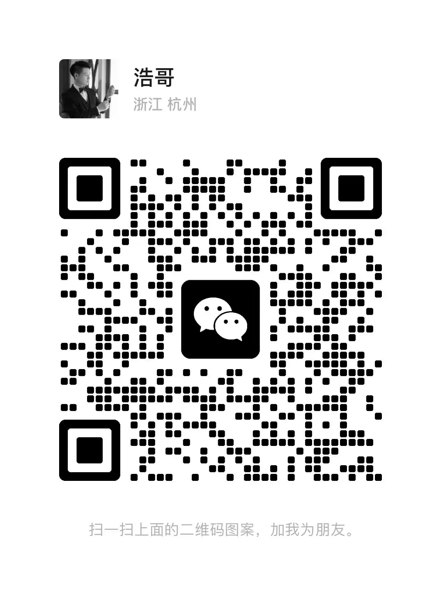

# ChatTTS-WebUI

[**English**](./README.md) | [**中文简体**](./README_CN.md)

## Project Introduction
This is an AI project that depends on the [ChatTTS](https://github.com/2noise/ChatTTS) project. The project includes a web user interface that allows users to interact with the model through the interface.

If you find it useful, please give it a star.

## Project Structure
```plaintext
my_ai_project/
│
├── ChatTTS               # Cloned directory of the ChatTTS project
│  └── ChatTTS            
│      ├── experimental   
│      ├── infer          
│      ├── model          
│      └── utils          
├── environment           # Virtual environment directory, contains all dependencies
├── models                # Model files directory
│  ├── asset              
│  └── config             
├── outputs               # Output files directory (e.g., logs, results, etc.)
├── webui                 # Web user interface code directory
│  ├── main.py            # Main entry file for the web user interface
│  └── ...                # Other files related to the web user interface
├── install.bat           # One-click installation script for installing and configuring the project
├── run_webui.bat         # Script to start the web user interface
├── update.bat            # Script to update the ChatTTS project
├── update_chatts.py      # Python script to update the ChatTTS project
└── requirements.txt      # Project dependencies file
```

## Installation

### Manual Installation
1. **Install Conda**:
   Download and install Miniconda or Anaconda from the [Conda official website](https://docs.conda.io/en/latest/miniconda.html).

2. **Clone this project**:
   ```sh
   git clone https://github.com/yuhaolove/ChatTTS-WebUI.git
   ```

3. **Create and activate a virtual environment**:
   ```sh
   cd ChatTTS-WebUI
   conda create -n chattts_webui python=3.12.3
   conda activate chattts_webui
   ```

4. **Clone the ChatTTS repository**:
   ```sh
   cd ChatTTS-WebUI
   git clone https://github.com/2noise/ChatTTS.git
   ```

5. **Install ChatTTS dependencies**:
   ```sh
   cd ChatTTS
   pip install -r requirements.txt
   cd ..
   ```

6. **Install this project's WebUI dependencies**:
   ```sh
   pip install -r requirements.txt
   ```

### One-click Installation Package on Windows
1. **Download and run the installation script**:
   Click here to download the one-click installation package.
   For first-time use, double-click or run `install.bat` in the command line. The installation will complete and directly start the webui.
   For subsequent use, just double-click `run_webui.bat`.

## Start the WebUI

### On Windows
Double-click or run `run_webui.bat` in the command line to start the Web user interface:
```sh
run_webui.bat
```

### On Other Systems
Not tested yet, you can directly use Conda's Python to start it:
```sh
python webui/main.py
```

## Manual Installation of Model Files
If you cannot download the HF model files smoothly, you can download them manually and place them in the corresponding directory.

1. **Download model files**:
   Go to the [model download page](https://www.modelscope.cn/models/pzc163/chatTTS/files) to download the model files.

2. **Place the files in the corresponding directory**:
   ```plaintext
   ├─models
   │  ├─asset
   │  └─config
   ```

## Notes
- Make sure you have a stable network connection to download dependencies and clone repositories.

## Contact
If you have any questions or need help, please contact [浩哥聊AI].


## Support

If you find this project helpful, please consider giving some support. Your support will help me continue to develop and maintain this project, and bring more useful features and improvements.

You can also scan the following QR codes to support:


| Alipay | WeChat Pay |
| ------ | -------- |
|  |  |

### Acknowledgments

The names of all supporters (if willing to be public) will be recorded in the project's acknowledgment list. Thank you for your support!
